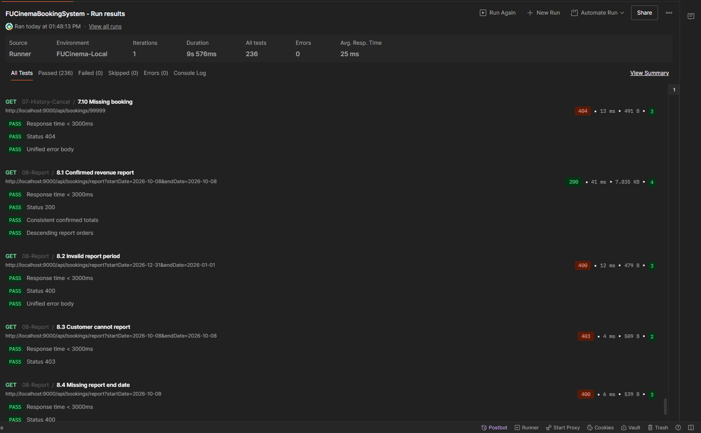

# FUCinemaBookingSystem — Assignment 01 MSS301

**Sinh viên:** Phạm Đặng Khoa — DE190530.

Backend gồm ba microservice độc lập và một API Gateway. Client gọi API qua `http://localhost:9000`. Mỗi service có Controller, Service, Repository, DTO record, Bean Validation và JSON lỗi thống nhất.

| Ứng dụng | Port | Database / chức năng |
|---|---:|---|
| customer-service | 8081 | SQL Server 2022, `cinema_customer`, Flyway, BCrypt, cấp JWT HS256 |
| movie-service | 8082 | MongoDB 7.0.5, `cinema_movie`, catalog, phòng, lịch chiếu |
| booking-service | 8083 | MySQL 8.3.0, `cinema_booking`, Flyway, đặt/hủy vé, báo cáo, OpenFeign |
| api-gateway | 9000 | Gateway Server Web MVC, OAuth2 Resource Server, phân quyền, header người dùng |

Java **21**, Spring Boot **4.1.0**, Spring Cloud **2025.1.3**. Bốn project được tạo từ Spring Initializr và có Maven Wrapper. Source được lưu trong repo MSS301 hiện tại; lịch sử commit có footer liên kết TODO.

## 1. Chuẩn bị và database

Cần JDK 21, Maven 3.9+ hoặc Maven Wrapper, Docker Desktop và Postman Desktop. Chạy các lệnh bên dưới từ thư mục `Assignment 1/fu-cinema`.

```powershell
java -version
docker compose up -d
docker compose ps -a
```

SQL Server Docker kết nối qua **127.0.0.2:1434** để tránh SQL Server Windows ở port 1433 và `127.0.0.1:1434`. URL JDBC nằm trong `customer-service/src/main/resources/application.properties`. Container vẫn dùng port 1433; container `sqlserver-init` kết nối nội bộ và tạo database sau khi SQL Server healthy. Cấu hình này đã được người dùng chọn cho máy hiện tại.

MySQL Docker cần cổng **3306** trống. Nếu MySQL Windows đang chạy, dừng dịch vụ `MySQL84` bằng PowerShell Administrator trước khi khởi động Docker:

```powershell
Stop-Service MySQL84
```

| Database | User | Password dùng cho bài lab |
|---|---|---|
| SQL Server | sa | `Fucinema@2026` |
| MongoDB | root | `password` — authentication database `admin` |
| MySQL | root | `mysql` |

Kết quả mong đợi: `cinema-sqlserver` healthy, `cinema-sqlserver-init` Exited (0), `cinema-mongo` và `cinema-mysql` Up. Flyway quản lý schema SQL Server/MySQL; `ddl-auto=none`. Movie Service tạo index và nạp dữ liệu MongoDB khi database chưa được seed.

## 2. Build và khởi động

```powershell
mvn -f customer-service/pom.xml clean package -DskipTests
mvn -f movie-service/pom.xml clean package -DskipTests
mvn -f booking-service/pom.xml clean package -DskipTests
mvn -f api-gateway/pom.xml clean package -DskipTests
```

Mở bốn terminal, chạy lần lượt Customer, Movie, Booking, Gateway:

```powershell
java -jar customer-service/target/customer-service-0.0.1-SNAPSHOT.jar
```

```powershell
java -jar movie-service/target/movie-service-0.0.1-SNAPSHOT.jar
```

```powershell
java -jar booking-service/target/booking-service-0.0.1-SNAPSHOT.jar
```

```powershell
java -jar api-gateway/target/api-gateway-0.0.1-SNAPSHOT.jar
```

Kiểm tra Gateway: `http://localhost:9000/actuator/health` trả `{"status":"UP"}`. Spring Cloud và Spring Boot giữ đúng phiên bản trong đề. Khi không có Maven cài sẵn, thay `mvn` bằng `./mvnw.cmd` trong thư mục của từng service.

## 3. Tài khoản và dữ liệu mẫu

| Vai trò | Email | Password | Trạng thái |
|---|---|---|---|
| Admin | admin@fucinema.com | `@@abc123@@` | Properties, ID 0 |
| Customer | an@gmail.com | `123456` | ACTIVE, ID 1 |
| Customer | binh@gmail.com | `123456` | ACTIVE, ID 2 |
| Customer | chi@gmail.com | `123456` | INACTIVE, ID 3 — login 403 |

MongoDB có 5 thể loại, 4 phòng, **5 phim**, 5 suất chiếu mẫu. Phim bổ sung “Biệt Đội Hành Động”, ID `66f200000000000000000005`, thuộc “Hành động” để test 3.6 kiểm tra chính xác quy tắc không xóa thể loại đang có phim. Các ID mẫu khác giữ nguyên hướng dẫn. Collection tạo suất chiếu mới ở tương lai nên có thể chạy sau ngày chiếu của dữ liệu seed.

Gateway xác minh JWT và ghi đè header `X-User-Id`, `X-User-Email`, `X-User-Role` từ client bằng claim của token. Booking Service gọi Movie Service trực tiếp qua OpenFeign. Giá vé và tổng tiền tính ở server; booking detail lưu snapshot phim, phòng và giờ chiếu. Hủy booking giải phóng ghế, giữ lịch sử. Báo cáo chỉ tính CONFIRMED, bao gồm toàn bộ ngày kết thúc, sắp xếp giảm dần.

## 4. Postman Desktop Collection Runner

Import hai file:

- [FUCinemaBookingSystem.postman_collection.json](postman/FUCinemaBookingSystem.postman_collection.json)
- [FUCinema-Local.postman_environment.json](postman/FUCinema-Local.postman_environment.json)

Chọn environment **FUCinema-Local**, chạy toàn bộ collection theo thứ tự **01-Auth → 08-Report**, một iteration. Có **85 request**, mỗi request có script kiểm tra status; các trường hợp cần thiết kiểm tra nội dung và lưu biến để request sau sử dụng. `gateway=http://localhost:9000`.

Collection sinh email, tên thể loại/phòng mới khi chạy. Tài khoản mới được đổi mật khẩu và đăng nhập lại; tài khoản seed `an@gmail.com` vẫn dùng `123456`. Không cần sửa ID thủ công. Chạy lại collection sẽ tạo thêm dữ liệu thử nghiệm; báo cáo đối chiếu tổng với danh sách CONFIRMED thực tế.

**BR14 / test 6.15:** Sau khi chạy collection chính, giữ environment đang có token và showtimeId, dừng Movie Service, chạy [FUCinema-BR14-Manual.postman_collection.json](postman/FUCinema-BR14-Manual.postman_collection.json). Kỳ vọng 503 với JSON lỗi. Khởi động lại Movie Service sau đó.

**Postman Desktop Runner — 08/10/2026:** một iteration, **236 assertion Passed, 0 Failed, 0 Errors**. Ảnh do sinh viên cung cấp sau khi chạy trực tiếp trên Desktop:



Request 5.3 dùng phòng mẫu Room 02. Nếu lần chạy trước bị gián đoạn trước bước 5.9, suất chiếu thử nghiệm có thể còn SCHEDULED và gây 409 khi chạy lại cùng ngày/giờ. Kiểm tra và hủy đúng suất chiếu thử nghiệm cũ bằng tài khoản Admin trước khi chạy lại; không cần reset toàn bộ database.

## 5. Kiểm thử

Kết quả thực tế và các bước còn chờ thực hiện được ghi tại [TEST_RESULTS.md](TEST_RESULTS.md).

Đã xác minh toàn bộ hệ thống với ba database Docker: **27 test JUnit**, **85 request / 236 assertion trong collection chính**, BR14 thực tế và các kiểm tra bổ sung đều pass. Chi tiết tại [verification-results.json](postman/verification-results.json). Postman Desktop Runner ngày 08/10/2026 cũng đạt **236 Passed, 0 Failed, 0 Errors**. Annotated tag `v1.0.0` đã được tạo tại commit `4bbe002`; tag này chưa bao gồm ảnh Desktop và tài liệu bổ sung sau đó.

Khi ba database đã sẵn sàng, chạy JUnit và kiểm tra ApplicationContext:

```powershell
mvn -f customer-service/pom.xml test
mvn -f movie-service/pom.xml test
mvn -f booking-service/pom.xml test
mvn -f api-gateway/pom.xml test
```

Các unit test nghiệp vụ xác minh JWT/BCrypt, chặn INACTIVE, BR04/BR05/BR15, giá/snapshot vé, ghế trùng/đã bán, Movie Service không phản hồi, quyền chủ sở hữu, thời hạn hủy, đặc quyền Admin và khoảng ngày báo cáo. Test ApplicationContext dùng database Docker thực tế.

Có thể chạy collection để kiểm tra tự động bằng Newman; Postman Desktop vẫn là bước chụp ảnh nộp bài:

```powershell
npx --yes newman run postman/FUCinemaBookingSystem.postman_collection.json -e postman/FUCinema-Local.postman_environment.json
```

Đối chiếu dữ liệu trực tiếp:

```powershell
docker exec cinema-sqlserver /opt/mssql-tools18/bin/sqlcmd -S localhost -U sa -P 'Fucinema@2026' -C -d cinema_customer -Q 'SELECT customer_id, customer_name, email, customer_status FROM customer'
docker exec cinema-mongo mongosh -u root -p password --authenticationDatabase admin cinema_movie --eval 'db.showtimes.findOne()'
docker exec cinema-mysql mysql -uroot -pmysql cinema_booking -e 'SELECT b.booking_id, b.booking_status, d.showtime_id, d.seat_code, d.movie_title FROM booking b JOIN booking_detail d ON d.booking_id = b.booking_id;'
```

Tên Customer lưu NVARCHAR và seed bằng literal Unicode `N'...'`. MongoDB lưu `_id` dạng ObjectId, `ticketPrice` dạng Decimal128; MySQL lưu tham chiếu ObjectId trong VARCHAR(24). Thư mục `target/`, `docker/` và `.runtime/` không được commit.
